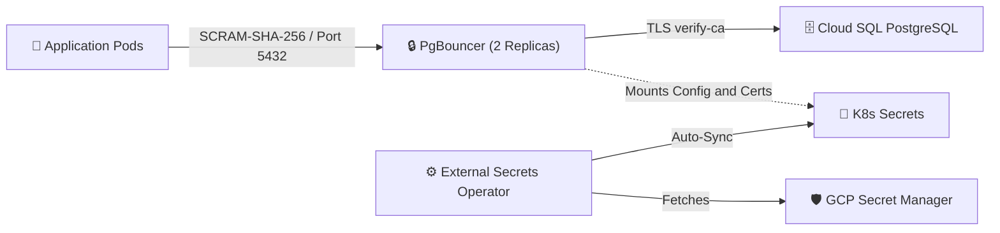

# Hardened & Highly-Available PgBouncer on GKE

A production-grade **`PgBouncer`** deployment for GKE with zero secrets in Git, **`Workload Identity Federation`**, **`External Secrets Operator (ESO)` for `GCP Secret Manager`**, **`SCRAM-SHA-256`** authentication, enforced TLS to Cloud SQL, verified supply chain integrity, and a fully hardened runtime security context.

## Architecture Topology

The following diagram illustrates how credentials flow securely from Google Cloud Secret Manager into GKE, and how clients connect to Cloud SQL through PgBouncer:



---

## Features & Enhancements

- **Zero Secrets in Git:** Sensitive configuration details (passwords, server CA certificates, and target host IPs) are managed securely in GCP Secret Manager.
- **Automated Sync with ESO:** The External Secrets Operator maps Secret Manager properties directly to native Kubernetes Secrets in the GKE cluster.
- **Workload Identity Integration:** Access to GCP Secret Manager is restricted to the specific GKE Service Account (`prod-pgbouncer-sa`) using GCP IAM and Workload Identity (no hardcoded GCP keys).
- **Secure Runtime Contexts:** Pods run as non-root (UID/GID `70`), enforce a read-only root filesystem, drop all Linux capabilities, and implement `RuntimeDefault` seccomp and AppArmor profiles (Kubernetes 1.30+).
- **High Availability & Anti-Affinity:** Scaled to **2 replicas** with a `PodDisruptionBudget` (`minAvailable: 1`) and soft Pod Anti-Affinity rules to distribute pods across separate VMs.
- **Enforced Backend TLS:** Configured with `server_tls_sslmode = verify-ca`, requiring PgBouncer to validate the Cloud SQL instance certificate against the official server CA file.
- **Zero-Downtime Hot-Reload:** Safe, separate mounting directories allow updating configurations (`pgbouncer.ini` or `userlist.txt`) live without restarting active client connections.
- **Immutable Base Images:** Compiles and runs inside Docker containers pinned to immutable base image digests (`debian:bookworm-slim@sha256:...`) to prevent supply chain tag-poisoning attacks.

---

## Production-Grade Security & Durability

This deployment is built for high reliability and follows strict enterprise security best practices:

### 🛡️ Hardened Security Contexts
- **Least Privilege (Non-Root):** Container execution runs under UID/GID `70` (`pgbouncer`), ensuring the process cannot gain root access on the host node.
- **Read-Only Filesystem:** The root filesystem is mounted as read-only (`readOnlyRootFilesystem: true`), blocking runtime modifications to container binaries. Ephemeral run files are written to a secure memory-backed `emptyDir` volume (`/var/run/pgbouncer`).
- **Privilege Escalation Blocked:** `allowPrivilegeEscalation: false` prevents child processes from gaining more privileges than their parent.
- **System Call Restriction:** All Linux capabilities are dropped (`drop: - ALL`), and the standard `RuntimeDefault` seccomp profile is applied to restrict access to unsafe system calls.
- **Kernel Confinement (AppArmor):** Enforces an `appArmorProfile.type = RuntimeDefault` profile (Kubernetes 1.30+) to restrict file, network, and capability access at the OS kernel level.
- **SCRAM-SHA-256 Hashed Secrets:** To prevent storing plaintext database passwords in GKE's `etcd` or Kubernetes secrets, this configuration enforces the use of pre-hashed PostgreSQL SCRAM verifiers in `userlist.txt`.
- **Immutable Base Image Digests:** The builder and runtime base images are pinned using their SHA-256 digest (`debian:bookworm-slim@sha256:...`) to guarantee that GKE nodes and the build pipeline run the exact, untampered OS packages.

### 🔋 High Availability & Durability
- **Pod Disruption Budget (PDB):** Guarded by a PDB requiring `minAvailable: 1`, ensuring that cluster upgrades or maintenance never take down both replicas simultaneously.
- **Node Anti-Affinity:** Utilizes a soft `podAntiAffinity` spread rule (`topologyKey: kubernetes.io/hostname`) to prioritize distributing PgBouncer pods across separate GKE nodes, preventing a single hardware failure from causing a outage.
- **Graceful Shutdown:** Configured with a `preStop` lifecycle hook sleep period of 180s, allowing active client queries to finish processing and GKE endpoints to propagate before termination.

### 🐳 Parameterized & Secure Docker Builds
- **Docker Build Arguments:** The `Dockerfile` compiles PgBouncer from source using `ARG PGBOUNCER_VERSION=1.25.2` and `ARG PGBOUNCER_SHA256`. This decouples the compilation process, making base image updates and version bumps clean and modular. Version details can be tracked in the official [PgBouncer Changelog](https://www.pgbouncer.org/changelog.html).
- **Source Integrity Verification:** Enforces security at build-time by verifying the SHA-256 checksum of the downloaded PgBouncer source tarball (`sha256sum -c -`) before configuring and compiling. This prevents compilation of compromised or corrupted packages. You can verify and obtain the official checksums from the [PgBouncer Downloads Page](https://www.pgbouncer.org/downloads/).

---


## Build and Deploy

> [!NOTE]
> **Prerequisites & Security Status:**
> This deployment guide assumes that the **External Secrets Operator (ESO)** is already installed in your Kubernetes cluster with a highly strict security configuration and fully audited **RBAC policies** to comply with the principle of least privilege.

> [!TIP]
> In a production environment, configuring and provisioning GCP infrastructure (Secret Manager, IAM Service Accounts, GKE Service Accounts, and IAM bindings) should be automated using **Terraform** or a similar Infrastructure-as-Code (IaC) tool. For simplicity in this tutorial, we use `gcloud` CLI commands.

### 1. Build and Push Docker Image (v2)

To compile PgBouncer 1.25.2 from source inside a Debian Bookworm multi-stage build targeting the GKE node architecture (`linux/amd64`):

```bash
docker build --no-cache --platform linux/amd64 -t asia-southeast2-docker.pkg.dev/your-gcp-project-id/hades/prod/pgbouncer:v2 .
docker push asia-southeast2-docker.pkg.dev/your-gcp-project-id/hades/prod/pgbouncer:v2

# Get the immutable SHA-256 digest of the pushed image
docker inspect --format='{{index .RepoDigests 0}}' asia-southeast2-docker.pkg.dev/your-gcp-project-id/hades/prod/pgbouncer:v2
```

> [!TIP]
> **Production Best Practice (Immutable Image Digests):**
> For production environments, reference the image in `deployment-pgbouncer.yaml` by its immutable SHA-256 digest (e.g., `pgbouncer@sha256:abc123yoursha...`) rather than a mutable tag like `:v2`. This ensures that Kubernetes always pulls the exact verified container binary.

### 2. Configure GCP Secret Manager (gcloud)

> [!IMPORTANT]
> **Production Password Security (SCRAM-SHA-256 Hashing):**
> Storing raw plaintext passwords in Kubernetes Secrets is a security risk. Because this deployment configures `auth_type = scram-sha-256` in PgBouncer, you should store the pre-calculated PostgreSQL **SCRAM verifiers** (hashes) in GCP Secret Manager instead of raw plaintext passwords.
> 
> To configure `scram-sha-256` authentication, you need the SCRAM verifiers (hashes starting with `SCRAM-SHA-256$...`) for your database users. 
> 
> Since managed databases like **GCP Cloud SQL** restrict read access to the `pg_shadow` system catalog (resulting in `permission denied for view pg_shadow` for non-superuser accounts), you can generate the SCRAM verifiers locally using Python instead of querying the database.
> 
> Run the following command in your terminal, replacing `your-password-here` with the actual user password:
> ```bash
> python3 -c "import os, base64, hashlib, hmac; pwd = b'your-password-here'; salt = os.urandom(16); sp = hashlib.pbkdf2_hmac('sha256', pwd, salt, 4096); ck = hmac.new(sp, b'Client Key', hashlib.sha256).digest(); sk = hmac.new(sp, b'Server Key', hashlib.sha256).digest(); stk = hashlib.sha256(ck).digest(); print(f'SCRAM-SHA-256\$4096:{base64.b64encode(salt).decode()}\${base64.b64encode(stk).decode()}:{base64.b64encode(sk).decode()}')"
> ```
> This will output a valid SCRAM-SHA-256 verifier, for example:
> `SCRAM-SHA-256$4096:JgExJO4vIVzTa/8Z82cyXQ==$RFfvT0fzv+Lai3x6CNoUi0Hl4Z9PXazH29Awcrgk8T4=:Dp+J9TfyqsHavkXM99kDcaCbjQFAzayb1jPXle2oIic=`
> 
> Save the generated verifiers under `db_password_user` and `db_password_transaction` in your Secret Manager JSON payload.
>
> [!IMPORTANT]
> **Separation of Credentials (Least Privilege):**
> * **PgBouncer's Secret (`prod-pgbouncer-secrets`):** Stores only the **SCRAM verifiers** (hashes) for authentication. PgBouncer uses these to populate `userlist.txt` and verify client handshakes.
> * **Client Applications:** Must use the corresponding **plaintext passwords** (stored in a separate, application-specific Secret) to connect to PgBouncer. Do not configure client applications to read from PgBouncer's secret, as they require the raw password to compute the client-side SCRAM handshake.

Create the Google Service Account (GSA), download the database server CA certificate, construct the JSON payload, and create the secret:

```bash
# Set GCP Project context
gcloud config set project your-gcp-project-id

# 1. Create a dedicated Google Service Account (GSA) for PgBouncer
gcloud iam service-accounts create prod-pgbouncer-gsa \
  --display-name="PgBouncer Production GSA" \
  --project=your-gcp-project-id

# 2. Download SSL CA certificate directly from Cloud SQL instance
gcloud sql instances describe your-cloudsql-instance \
  --format="value(serverCaCert.cert)" > server-ca.pem

# 3. Build JSON payload containing all sensitive PgBouncer configuration details (using SCRAM verifier hashes)
python3 -c '
import json
ca_cert = open("server-ca.pem").read()
payload = {
    "db_password_user": "SCRAM-SHA-256$4096:your-db-scram-verifier-for-user",
    "db_password_transaction": "SCRAM-SHA-256$4096:your-db-scram-verifier-for-transaction",
    "server_ca": ca_cert
}
with open("pgbouncer_secrets_payload.json", "w") as f:
    json.dump(payload, f, indent=2)
'

# 4. Create the Secret Manager secret
gcloud secrets create prod-pgbouncer-secrets --replication-policy="automatic"

# 5. Upload the JSON payload as version 1
gcloud secrets versions add prod-pgbouncer-secrets --data-file=pgbouncer_secrets_payload.json

# 6. Grant read permission to the newly created GSA on the secret
gcloud secrets add-iam-policy-binding prod-pgbouncer-secrets \
  --role="roles/secretmanager.secretAccessor" \
  --member="serviceAccount:prod-pgbouncer-gsa@your-gcp-project-id.iam.gserviceaccount.com" \
  --project=your-gcp-project-id

# 7. Clean up temporary files
rm server-ca.pem pgbouncer_secrets_payload.json
```

### 3. Configure GKE Workload Identity & Deploy

Create the GKE Service Account, bind it to the GCP GSA, and deploy the manifests to the `prod-hades` namespace:

```bash
# Ensure you are operating in the correct GKE namespace
kubectl config set-context --current --namespace=prod-hades

# 1. Allow GKE KSA to impersonate GCP GSA (Workload Identity binding)
gcloud iam service-accounts add-iam-policy-binding prod-pgbouncer-gsa@your-gcp-project-id.iam.gserviceaccount.com \
  --role="roles/iam.workloadIdentityUser" \
  --member="serviceAccount:your-gcp-project-id.svc.id.goog[prod-hades/prod-pgbouncer-sa]" \
  --project=your-gcp-project-id

# 2. Apply static ConfigMap first
kubectl apply -f configmap-pgbouncer.yaml

# 3. Apply ServiceAccount, SecretStore, and ExternalSecrets (this generates all required K8s Secrets)
kubectl apply -f external-secret-pgbouncer.yaml

# 4. Verify that Kubernetes Secrets are successfully synchronized by ESO
# (Note: Workload Identity propagation can take 30-60s. If empty, wait a moment and retry)
kubectl get secrets -n prod-hades

# 5. Apply deployment, service, and PodDisruptionBudget
kubectl apply -f deployment-pgbouncer.yaml
```

> [!NOTE]
> GCP IAM policy and GKE Workload Identity bindings can take **30 to 60 seconds** to propagate. If the secrets do not sync immediately, you can inspect their status using:
> ```bash
> kubectl get externalsecret -n prod-hades
> ```

---

## Connection Pool Sizing & Tuning

Since this deployment uses **2 replicas** in production for high availability, be mindful of how connection pools scale against your backend database's limits.

### Formula for Maximum Backend Connections
```text
Total Connections = (Number of Configured Database Users) * (default_pool_size) * (Replicas)
```

With **4 application users**, a `default_pool_size` of **40**, and **2 replicas**, the total maximum connections from PgBouncer to your PostgreSQL database can reach:
```text
4 * 40 * 2 = 320 connections
```

### Best Practices:
1. **Check Backend Limit:** Find your database's connection limit by running:
   ```sql
   SHOW max_connections;
   ```
2. **Leave Headroom:** Ensure the calculated maximum connections from PgBouncer are safely below your database's `max_connections`, leaving a margin (e.g., 20-30 connections) for direct administrator or analytics tool logins.
3. **Adjust Config:** Tune `default_pool_size` in `configmap-pgbouncer.yaml` accordingly before applying updates.
4. **Use Immutable Image Digests (Production):** Pin the container image by its SHA-256 digest (e.g., `pgbouncer@sha256:abc123yoursha...`) instead of mutable tags in `deployment-pgbouncer.yaml` to ensure reproducibility (see Step 1 for details).

---

## Operations & Hot-Reloading

### Reloading configuration without downtime
Since we mount the Secrets directly (without using `subPath`), Kubernetes automatically updates the mounted files inside the container when the Secret Manager payload updates.

To apply changes to `pgbouncer.ini` or `userlist.txt` dynamically without any downtime or restarting the pods, run a SIGHUP command on the container process:

```bash
# Send SIGHUP signal to the pgbouncer process
kubectl exec -it -n prod-hades deployment/pgbouncer -- sh -c "kill -HUP 1"
```

This will trigger PgBouncer to re-read the configuration files from disk and apply the changes in memory instantly, without dropping any active client connections.

---

## References

### ⚙️ General & Operations
- [Official PgBouncer Downloads & SHA-256 Checksums](https://www.pgbouncer.org/downloads/)
- [Official PgBouncer Changelog](https://www.pgbouncer.org/changelog.html)
- [Kubernetes Pod Disruption Budgets (PDB)](https://kubernetes.io/docs/concepts/workloads/pods/disruptions/#pod-disruption-budgets)
- [Kubernetes Pod Affinity and Anti-Affinity](https://kubernetes.io/docs/concepts/scheduling-eviction/assign-pod-node/#affinity-and-anti-affinity)

### 🛡️ Hardening & Security
- [GCP Secret Manager Overview](https://cloud.google.com/secret-manager/docs/overview)
- [GKE Workload Identity Documentation](https://cloud.google.com/kubernetes-engine/docs/how-to/workload-identity)
- [External Secrets Operator (ESO)](https://docs.cloud.google.com/distributed-cloud/connected/latest/docs/external-secrets)
- [Configure SSL/TLS on Cloud SQL PostgreSQL](https://docs.cloud.google.com/sql/docs/postgres/configure-ssl-instance)
- [Kubernetes Pod & Container Security Contexts](https://kubernetes.io/docs/tasks/configure-pod-container/security-context/)
- [Kubernetes RBAC Least Privilege Best Practices](https://snyk.io/blog/applying-the-principle-of-least-privilege-to-kubernetes-using-rbac/)
- [GKE RBAC Authorization Best Practices](https://cloud.google.com/kubernetes-engine/docs/best-practices/rbac)
- [OWASP Docker Security Cheat Sheet](https://cheatsheetseries.owasp.org/cheatsheets/Docker_Security_Cheat_Sheet.html)
- [Chainguard Docker Security Best Practices](https://www.chainguard.dev/supply-chain-security-101/top-7-docker-security-risks-and-best-practices)
