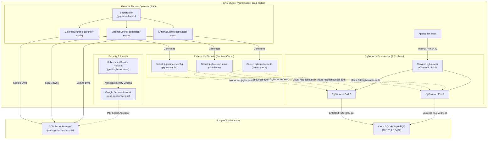

# k8s-pgbouncer

A hardened, highly-available, and modernized PgBouncer deployment for GKE utilizing GCP Secret Manager and the External Secrets Operator (ESO).

## Architecture Topology

The following diagram illustrates how credentials flow securely from Google Cloud Secret Manager into GKE, and how clients connect to Cloud SQL through PgBouncer:



---

## Features & Enhancements

- **Zero Secrets in Git:** Sensitive configuration details (passwords, server CA certificates, and target host IPs) are managed securely in GCP Secret Manager.
- **Automated Sync with ESO:** The External Secrets Operator maps Secret Manager properties directly to native Kubernetes Secrets in the GKE cluster.
- **Workload Identity Integration:** Access to GCP Secret Manager is restricted to the specific GKE Service Account (`prod-pgbouncer-sa`) using GCP IAM and Workload Identity (no hardcoded GCP keys).
- **Secure Runtime Contexts:** Pods run as non-root (UID/GID `70`), enforce a read-only root filesystem, drop all Linux capabilities, and implement a `RuntimeDefault` seccomp profile.
- **High Availability & Anti-Affinity:** Scaled to **2 replicas** with a `PodDisruptionBudget` (`minAvailable: 1`) and soft Pod Anti-Affinity rules to distribute pods across separate VMs.
- **Enforced Backend TLS:** Configured with `server_tls_sslmode = verify-ca`, requiring PgBouncer to validate the Cloud SQL instance certificate against the official server CA file.
- **Zero-Downtime Hot-Reload:** Safe, separate mounting directories allow updating configurations (`pgbouncer.ini` or `userlist.txt`) live without restarting active client connections.

---

## Build and Deploy

### 1. Build and Push Docker Image (v2)

To compile PgBouncer 1.25.2 from source inside a Debian Bookworm multi-stage build targeting the GKE node architecture (`linux/amd64`):

```bash
docker build --no-cache --platform linux/amd64 -t asia-southeast2-docker.pkg.dev/your-gcp-project-id/hades/prod/pgbouncer:v2 .
docker push asia-southeast2-docker.pkg.dev/your-gcp-project-id/hades/prod/pgbouncer:v2
```

### 2. Configure GCP Secret Manager (gcloud)

Create the Google Service Account (GSA), download the database server CA certificate, construct the JSON payload, and create the secret:

```bash
# Set GCP Project context
gcloud config set project your-gcp-project-id

# 1. Create a dedicated Google Service Account (GSA) for PgBouncer
gcloud iam service-accounts create prod-pgbouncer-gsa \
  --display-name="PgBouncer Production GSA" \
  --project=your-gcp-project-id

# 2. Download SSL CA certificate directly from Cloud SQL instance
gcloud sql instances describe your-cloudsql-instance \
  --format="value(serverCaCert.cert)" > server-ca.pem

# 3. Build JSON payload containing all sensitive PgBouncer configuration details
python3 -c '
import json
ca_cert = open("server-ca.pem").read()
payload = {
    "db_ip": "10.100.1.5",
    "db_password": "your-db-password",
    "admin_password": "your-admin-password",
    "server_ca": ca_cert
}
with open("pgbouncer_secrets_payload.json", "w") as f:
    json.dump(payload, f, indent=2)
'

# 4. Create the Secret Manager secret
gcloud secrets create prod-pgbouncer-secrets --replication-policy="automatic"

# 5. Upload the JSON payload as version 1
gcloud secrets versions add prod-pgbouncer-secrets --data-file=pgbouncer_secrets_payload.json

# 6. Grant read permission to the newly created GSA on the secret
gcloud secrets add-iam-policy-binding prod-pgbouncer-secrets \
  --role="roles/secretmanager.secretAccessor" \
  --member="serviceAccount:prod-pgbouncer-gsa@your-gcp-project-id.iam.gserviceaccount.com" \
  --project=your-gcp-project-id

# 7. Clean up temporary files
rm server-ca.pem pgbouncer_secrets_payload.json
```

### 3. Configure GKE Workload Identity & Deploy

Create the GKE Service Account, bind it to the GCP GSA, and deploy the manifests to the `prod-hades` namespace:

```bash
# Ensure you are operating in the correct GKE namespace
kubectl config set-context --current --namespace=prod-hades

# 1. Create Kubernetes Service Account (KSA) in GKE namespace
kubectl create serviceaccount prod-pgbouncer-sa -n prod-hades

# 2. Annotate GKE KSA with the GCP GSA email to link them
kubectl annotate serviceaccount prod-pgbouncer-sa \
  -n prod-hades \
  iam.gke.io/gcp-service-account=prod-pgbouncer-gsa@your-gcp-project-id.iam.gserviceaccount.com

# 3. Allow GKE KSA to impersonate GCP GSA (Workload Identity binding)
gcloud iam service-accounts add-iam-policy-binding prod-pgbouncer-gsa@your-gcp-project-id.iam.gserviceaccount.com \
  --role="roles/iam.workloadIdentityUser" \
  --member="serviceAccount:your-gcp-project-id.svc.id.goog[prod-hades/prod-pgbouncer-sa]" \
  --project=your-gcp-project-id

# 4. Apply SecretStore and ExternalSecrets (this generates all required K8s Secrets)
kubectl apply -f external-secret-pgbouncer.yaml

# 5. Verify that Kubernetes Secrets are successfully synchronized by ESO
# (Note: Workload Identity propagation can take 30-60s. If empty, wait a moment and retry)
kubectl get secrets -n prod-hades

# 6. Apply deployment, service, and PodDisruptionBudget
kubectl apply -f deployment-pgbouncer.yaml
```

> [!NOTE]
> GCP IAM policy and GKE Workload Identity bindings can take **30 to 60 seconds** to propagate. If the secrets do not sync immediately, you can inspect their status using:
> ```bash
> kubectl get externalsecret -n prod-hades
> ```

---

## Connection Pool Sizing & Tuning

Since this deployment uses **2 replicas** in production for high availability, be mindful of how connection pools scale against your backend database's limits.

### Formula for Maximum Backend Connections
```text
Total Connections = (Number of Configured Database Users) * (default_pool_size) * (Replicas)
```

With **4 application users**, a `default_pool_size` of **40**, and **2 replicas**, the total maximum connections from PgBouncer to your PostgreSQL database can reach:
```text
4 * 40 * 2 = 320 connections
```

### Best Practices:
1. **Check Backend Limit:** Find your database's connection limit by running:
   ```sql
   SHOW max_connections;
   ```
2. **Leave Headroom:** Ensure the calculated maximum connections from PgBouncer are safely below your database's `max_connections`, leaving a margin (e.g., 20-30 connections) for direct administrator or analytics tool logins.
3. **Adjust Config:** Tune `default_pool_size` in `external-secret-pgbouncer.yaml` accordingly before applying updates.

---

## Operations & Hot-Reloading

### Reloading configuration without downtime
Since we mount the Secrets directly (without using `subPath`), Kubernetes automatically updates the mounted files inside the container when the Secret Manager payload updates.

To apply changes to `pgbouncer.ini` or `userlist.txt` without restarting the pod:

1. Update and apply the GCP Secret Manager secret version.
2. Run a SIGHUP command on the container process, or connect to the PgBouncer administrative console and run `RELOAD`:

```bash
# Option A: Send SIGHUP signal to the pgbouncer process
kubectl exec -it -n prod-hades deployment/pgbouncer -- kill -HUP 1

# Option B: Connect to administrative console and reload
psql -h pgbouncer -p 5432 -U postgres pgbouncer
# (Enter the postgres admin password set in userlist.txt)
pgbouncer=# RELOAD;
```
